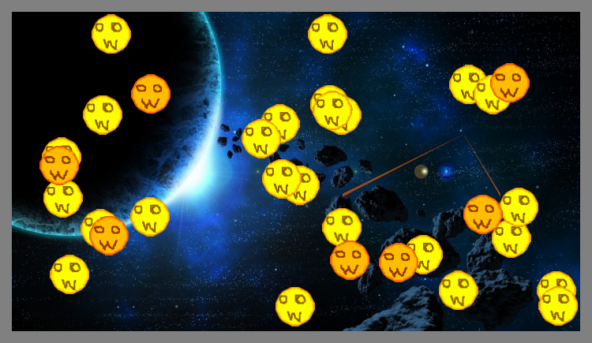

# まるおシューティング (Canvas Practice)

## 概要

* Canvasを使って遊べるアプリをつくる。

* Chrome（70.0.3538.102）で使えるES6の構文を使う。

* [Demo](https://retas-seven.github.io/main.html "Demo")

左クリックで射撃。

 

 

## 対応ブラウザ

* Chrome のみ（他のブラウザは動作未検証）

